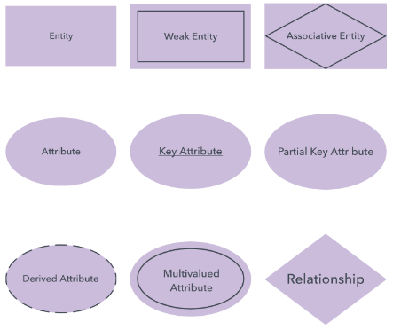

# Anotações do curso Modelagem de Bancos de Dados Relacionais, Não Relacionais e Data Stores do DataScience Academy

## Tipos de modelagem

Modelagem de dados é o ato de explorar estruturas orientadas a dados. Do ponto de um desenvolvedor modelagem é conceitualmente semelhante à modelagem de classes.
Para criar um modelo de dados, geralmente dividimos em três partes:

* Modelagem  Conceitual:  é  usada  como  representação  de  alto  nível  e  considera exclusivamente o ponto de vista do usuário criador dos dados.
* Modelagem Lógica: agrega mais alguns detalhes de implementação.
    - Normalmente descreveos requisitos de dados para um único projeto ou área de assunto principal.
    - Pode ser integrado com outros modelos de dados lógicos por meio de um repositório de entidades compartilhadas.
    - Normalmente contém 10-1000 entidades, embora esses números sejam altamente variáveis, dependendo do escopo do modelo de dados.
    - Contém relacionamentos entre entidades que tratam de cardinalidade e nulidade (opcionalidade) dos relacionamentos.- Projetado e desenvolvido para ser independente de DBMS, locais de armazenamento de dados ou tecnologias. Na - verdade, pode abordar conceitos digitais e não digitais.
    - Os  atributos  de  dados  normalmente  têm  tipos  de  dados  com  precisões  e comprimentos atribuídos.•Os atributos de dados terão nulidade (opcionalidade) atribuída.
    - Entidades e atributos terão definições.•Todos  os  tipos  de  outros  metadados  podem  ser  incluídos  (regras  de  retenção, indicadores  de  privacidade,  volumetria,  linhagem  de  dados,  etc.)  Na  verdade,  o diagrama  de  um  modelo  de  dados  lógico  pode  mostrar  apenas  uma  pequena porcentagem dos metadados contidos no modelo.
    - Um modelo lógico de dados normalmente será derivado de e / ou vinculado a objetos em um modelo de dados conceitual.

* Modelagem Física: demonstra como os dados são fisicamente armazenados.
    - Normalmente descreve os requisitos de dados para um único projeto ou aplicativo. Às vezes, até mesmo uma parte de um aplicativo.
    - Pode ser integrado com outros modelos de dados físicos por meio de um repositório de entidades compartilhadas
    - Normalmente  contém  10-1000  tabelas,  embora  esses  números  sejam  altamente variáveis, dependendo do escopo do modelo de dados.
    - Contém  relacionamentos  entre  tabelas  que  tratam  da  cardinalidade  e  nulidade (opcionalidade) dos relacionamentos.
    - Projetado  e  desenvolvido  para  ser  dependente  de  uma  versão  específica  de  um DBMS, local de armazenamento de dados ou tecnologia.
    - As colunas terão tipos de dados com precisões e comprimentos atribuídos.
    - As colunas terão nulidade (opcionalidade) atribuída.
    - As tabelas e colunas terão definições.
    - Também  incluirá  outros  objetos  físicos,  como  visualizações,  restrições  de  chave primária,  restrições  de  chave  estrangeira,  índices,  funções  de  segurança, procedimentos de armazenamento, extensões XML, armazenamentos de arquivos, etc.
    - O  diagrama  de  um  modelo físico de  dados  pode  mostrar  apenas  uma  pequena porcentagem dos metadados contidos no modelo.

Não é obrigatório criar os três, porém é uma boa prática.

### Tipos de banco de dados não relacional
* Key-Value
* Tabular ou Colunar
* Document
* Graph

### Tipos de banco de dados relacional
* Relational
    * Visão macro da implementação: 
        1. Criar schema;
        2. Criar o modelo;
            - Lógico
            - Físico
        3. ETL

## Diagrama ER
* (DER) é um tipo de fluxograma que ilustra como “entidades”, por exemplo, pessoas, objetos ou conceitos, se relacionam entre si dentro de um sistema
<div align="center">
    
</div>

## Ferramentas de modelagem de dados

* Facilitam o trabalho de modelagem
* Permitem o trabalho colaborativo
* Permitem fazer o track das alterações (documentação)
* Automatizam parte do trabalho
* Facilitam a integração de sistemas
* Reduzem o tempo total do projeto
* Reduzem os erros

### Principais Ferramentas
* Ferramentas
    - https://www.guru99.com/data-modeling-tools-design-database.html
    - https://www.softwaretestinghelp.com/data-modeling-tools/
    - https://dbmstools.com/categories/data-modeling-tools


## Boas práticas
* Criar dois schemas:
    1. Um schema para manipulação das tabelas;
    2. Um schema para manipulação dos dados;

## Ferramentas usadas nesse curso
* DbSchema
    -  https://dbschema.com/
* Archi
    - https://www.archimatetool.com/donate/
* Docker
    - https://www.docker.com/


## Comandos docker para instalação do oracle DB

* Copia o repositório do docker-images da oracle
```bash
git clone https://github.com/raul-gomes/docker-images.git
```
* Baixar a imagem do oracle 19C, versão ZIP
    - https://www.oracle.com/database/technologies/oracle-database-software-downloads.html

* Copiar a imagem do oracle para a pasta especifica
```bash
sudo cp < diretório >/LINUX.X64_193000_db_home.zip /var/docker/docker-images/OracleDatabase/SingleInstance/dockerfiles/19.3.0/
```

* Cria imagem
```bash
sudo ./buildDockerImage.sh -v 19.3.0 -e
```
ou
```bash
docker build -t oracle/database:19.3.0-EE --build-arg DB_EDITION=EE .
```

* Cria conteiner
```bash
docker run --name oracle -p 1522:1521 -p 5501:5500 -p 2485:2484 -e ORACLE_PWD=640138 -v /opt/oracle:/u01/oracle oracle/database:19.3.0-ee
```
* Rodar o conteiner
```bash
docker run oracle
```

### Alguns comando adicionais de docker
* Muda a senha do <i>system</i> caso necessário
```bash
sudo docker exec oracle19c ./setPassword.sh oracle
```

* Executa dentro do conteiner o comando
```bash
sudo docker exec -ti oracle19c sqlplus system/oracle@orclpdb1
```


